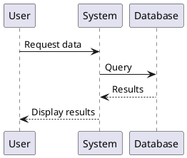

# PlantUML-Portable

A portable PlantUML diagram generator that works on both Windows and macOS/Linux systems.

## 📋 Prerequisites

### Windows
- No additional installation required (bundled JRE included)

### macOS/Linux
- Java Runtime Environment (JRE) must be installed
- Install via Homebrew: `brew install openjdk`
- Or download from: https://www.oracle.com/java/technologies/downloads/

## � Downloads

If you need to set up PlantUML-Portable from scratch or update components, download the following:

### Required Components

- **PlantUML JAR** (v1.2025.10)  
  [Download plantuml-1.2025.10.jar](https://github.com/plantuml/plantuml/releases/tag/v1.2025.10)

### Windows-Only Components

- **Java Runtime Environment (JRE 17)**  
  [Download OpenJDK 17 JRE for Windows (x64)](https://adoptium.net/download?link=https%3A%2F%2Fgithub.com%2Fadoptium%2Ftemurin17-binaries%2Freleases%2Fdownload%2Fjdk-17.0.17%252B10%2FOpenJDK17U-jre_x64_windows_hotspot_17.0.17_10.zip&vendor=Adoptium)  
  Extract to `bin/jre/` folder

- **Graphviz** (v14.0.5) - For advanced diagram features  
  [Download Graphviz 14.0.5 for Windows](https://gitlab.com/api/v4/projects/4207231/packages/generic/graphviz-releases/14.0.5/windows_10_cmake_Release_Graphviz-14.0.5-win64.zip)  
  Extract to `bin/graphviz/` folder

## �🚀 Usage

### Windows

Generate a PlantUML diagram to SVG format:

```bash
.\bin\start.bat .\diagrams\1.puml
```

This will:
- Process the `.puml` file
- Generate an SVG diagram
- Save the output to the `output` folder

### macOS/Linux

Generate a PlantUML diagram to SVG format:

```bash
chmod +x ./bin/start.sh  # Make the script executable (first time only)
./bin/start.sh diagrams/1.puml
```

This will:
- Process the `.puml` file
- Generate an SVG diagram
- Save the output to the `output` folder

## 📁 Directory Structure

```
PlantUML-Portable/
├── bin/               # All executables and dependencies
│   ├── jre/          # Java Runtime (Windows only)
│   ├── graphviz/     # Graphviz for advanced diagrams (Windows only)
│   ├── plantuml-1.2025.10.jar  # PlantUML engine
│   ├── start.bat     # Windows launcher script
│   └── start.sh      # macOS/Linux launcher script
├── diagrams/         # Your PlantUML source files (.puml)
│   └── 1.puml       # Example diagram
├── output/           # Generated diagrams (auto-created)
└── README.md         # This file
```

## 📝 Creating Diagrams

1. Create a new `.puml` file in the `diagrams` folder
2. Write your PlantUML code (see example in `diagrams/1.puml`)
3. Run the appropriate script for your OS
4. Find the generated diagram in the output folder

### Example PlantUML Code



## 🔧 Customization

### Windows Script Options

The `start.bat` script includes:
- **Output format**: `-tsvg` (SVG format)
- **Output directory**: `output` folder
- **Graphviz support**: For advanced diagrams

To change the output format, edit `bin/start.bat` and modify the `-tsvg` parameter:
- `-tpng` for PNG
- `-tsvg` for SVG
- `-tpdf` for PDF

### macOS/Linux Script Options

The `start.sh` script generates SVG files to the `output` folder by default. To customize:

```bash
# Generate PNG instead of SVG
java -jar ./bin/plantuml-1.2025.10.jar -tpng -o ./output ./diagrams/1.puml

# Generate PDF
java -jar ./bin/plantuml-1.2025.10.jar -tpdf -o ./output ./diagrams/1.puml

# Specify different output directory
java -jar ./bin/plantuml-1.2025.10.jar -tsvg -o ./custom_output ./diagrams/1.puml
```

## 🐛 Troubleshooting

### Windows

**Error: "java.exe not found"**
- The bundled JRE should work automatically
- Check that `bin/jre/java/bin/java.exe` exists

### macOS/Linux

**Error: "Java is not installed"**
- Install Java using Homebrew: `brew install openjdk`
- Or download from Oracle's website

**Error: "Permission denied"**
- Make the script executable: `chmod +x ./bin/start.sh`

## 📚 Resources

- [PlantUML Official Documentation](https://plantuml.com/)
- [PlantUML Language Reference](https://plantuml.com/guide)
- [PlantUML Examples](https://real-world-plantuml.com/)

## 📄 License

PlantUML is distributed under the GPL license. See https://plantuml.com/ for more information.
